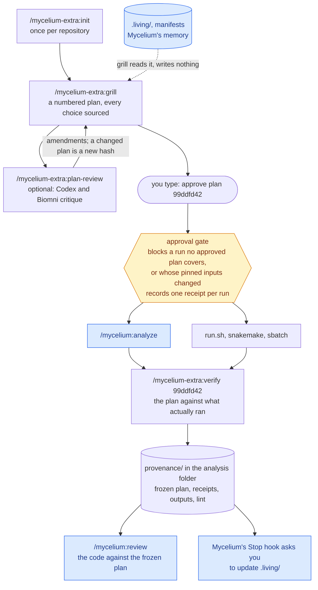

# Mycelium Extra

A standalone plugin for planning analysis work before it runs. It works alongside [Mycelium](https://github.com/arjunrajlaboratory/mycelium) but does not fork, modify, or require it.

It has nine skills and one hook set:

| Part | What it does | Writes |
|---|---|---|
| `grill` | Turns a proposed task into a sourced, numbered plan | Nothing |
| `plan-review` | Challenges a grill plan with independent Codex engineering and Biomni biomedical reviews before approval | Nothing; sends a review packet to Codex and to Biomni's cloud, after you agree |
| `decision-status` | Settles which past decision binds a task | Appends to `.living/decisions.md`, after you confirm |
| `data-contract-check` | Tests a plan's sample-table assumptions | Nothing |
| `init` | Turns on the approval gate in a repository | `.mycelium-extra/gate.json`, `.gitignore` |
| `new-analysis` | Creates a new analysis folder: numbered steps, a Snakefile, Mycelium's analysis doc, one plan, one tracker | The new folder only |
| `verify` | Checks an approved plan against what ran, then records provenance | `<analysis>/provenance/`, after you confirm |
| `handoff` | Writes a short handoff so a fresh session can continue | `HANDOFF.md` at the project root |
| `harden` | Ships a Mycelium learning's mitigation candidate as a real test | One test file; one `.living/learnings.md` entry, after you confirm |
| Approval gate | Blocks analysis runs until you approve the plan, blocks them if the plan's inputs changed, and records a receipt per run | `.mycelium-extra/` only |

Here is how a task moves through it, and where Mycelium takes over:



Blue is Mycelium's. `new-analysis`, `decision-status`, `data-contract-check`, `harden`, and `handoff` sit off this spine; `grill` calls the middle two itself.

## Installation

### Claude Code

1. Add the marketplace, from GitHub or from a local clone:

   ```bash
   claude plugin marketplace add mdmanurung/mycelium-extra
   # or
   claude plugin marketplace add /absolute/path/to/mycelium-extra
   ```

2. Install the plugin for all your projects:

   ```bash
   claude plugin install mycelium-extra@mycelium-extra
   ```

   To enable it for one project only, run this from that project with `--scope local`.

3. Start a new Claude Code session. Skills and hooks load when a session starts.

**Update** after pulling or editing the plugin (Claude Code runs a cached copy, keyed by the `version` in `.claude-plugin/plugin.json`):

```bash
claude plugin marketplace update mycelium-extra
claude plugin update mycelium-extra@mycelium-extra
```

**Try it without installing:** run `claude --plugin-dir /absolute/path/to/mycelium-extra` from the project.

### Codex

- **Plugin:** this folder includes `.codex-plugin/plugin.json` and `skills/*/SKILL.md`, ready to add to a Codex plugin marketplace. After installing, invoke `$mycelium-extra:<skill>`. The Codex manifest disables the Claude-only approval-gate hooks, so Codex does not load them from `hooks/hooks.json`. In Codex, `plan-review` provides the engineering critique only; Claude Code leads the two-reviewer synthesis.
- **Standalone skill:** copy one `skills/<skill>/` folder to your personal Codex skills location and invoke it as `$grill`. Namespacing then depends on how you installed it.

The approval gate, `init`, and `verify` are Claude Code only.

## Quick start

A typical analysis task, in order:

1. **Once per repository:** `/mycelium-extra:init` turns on the approval gate.
2. **Plan:** `/mycelium-extra:grill <your task>`. Answer its questions (at most five).
3. **Optional review:** before approval, invoke `/mycelium-extra:plan-review` in Claude Code for separate Codex and Biomni critiques. It recommends amendments but does not edit or approve the plan.
4. **Approve:** after any requested revision, use the new plan's `approve plan <hash>` line.
5. **Run and verify:** execute through your normal workflow (`/mycelium:analyze` in a Mycelium project), then use `/mycelium-extra:verify <hash>`.
6. **Optional run plan:** for a reportable, long, or HPC run, grill again once the code is written and linted. The run plan lists the Snakefile, `run.sh`, and step scripts on its `Inputs:` line so the gate freezes them, and shows a dry run (`bash run.sh -n`, under the first plan's approval) and tool versions. `verify diff <old> <new>` shows what changed before you approve it. See `skills/grill/references/run-plans.md`.

`grill` calls `decision-status` and `data-contract-check` itself when a plan depends on them, so you rarely need to invoke those directly. For a table of common prompts, see [docs/skills.md](docs/skills.md).

## Documentation

- [docs/skills.md](docs/skills.md) — each skill in detail, plus common prompts.
- [docs/approval-gate.md](docs/approval-gate.md) — approvals, gating rules, pinned inputs, run receipts, exploratory runs, command hints, and the full limits.
- [docs/mycelium-integration.md](docs/mycelium-integration.md) — how the plugin complements Mycelium without overriding it.
- [docs/development.md](docs/development.md) — tests, the gate-diff rule, Python 3.6 compatibility, version bumps.

The gate catches mistakes; it is not security. Read the full [limits](docs/approval-gate.md#limits) before relying on it.
