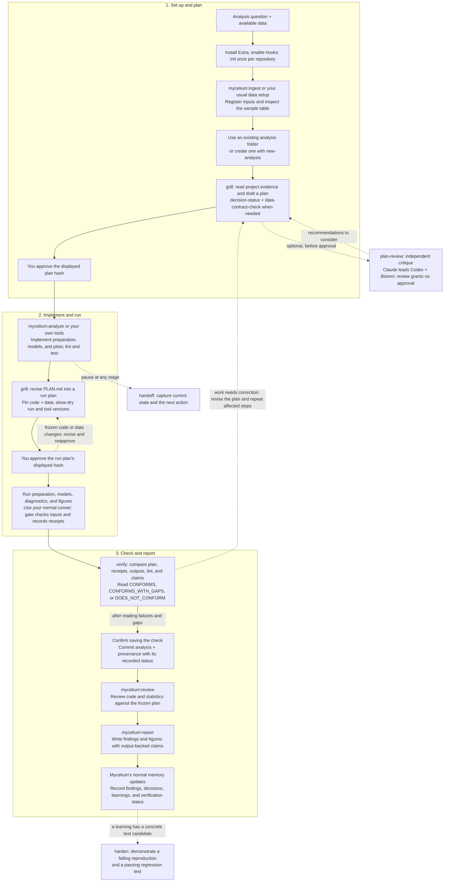

# Usage tiers

**Start with Tier 1 if you only need a plan. Use Tier 2 for your first run.**
Each tier adds to the previous one. These are workflow choices, not settings
or pricing levels. Install the [plugin for your host](installation.md) first.

| Tier | Use it when | Add these tools |
|---|---|---|
| 1. Plan | You want to clarify a question before writing or running code | `grill` |
| 2. Run with approval | You want execution checked against your plan | `init` once, then approval |
| 3. Verify reportable work | You will use the outputs in a finding or report | `verify`, a pinned run plan |
| 4. Full project workflow | You need structure, independent review, and continuity | `new-analysis`, `plan-review`, `handoff`, `harden`; Mycelium integration |

Examples use Claude Code's `/mycelium-extra:` prefix. In Codex, use
`$mycelium-extra:` instead. `approve plan <hash>` is the same in both hosts.

## Tier 1: Plan

One tool: **`grill`**.

```text
/mycelium-extra:grill Plan a paired treatment-response analysis. Read the sample table and existing decisions first.
```

Answer the questions that affect the plan, then read its steps, assumptions,
and input files. Planning writes nothing and runs no analysis. When needed,
`grill` calls `decision-status` and `data-contract-check` itself; you do not
need to memorize those commands.

This tier needs no gate setup. Planning alone provides no execution receipts
or enforcement. If the repository already has a gate, its rules still apply.

## Tier 2: Run with approval

Add **`init` once per repository**, with plugin hooks enabled.

1. Invoke `/mycelium-extra:init`. Check that it covers your analysis paths.
2. Invoke `/mycelium-extra:grill <your task>`. Read the plan and `Inputs:` line.
3. Send the exact displayed `approve plan <hash>` message in the same session.
4. Run the approved steps through your usual workflow. In a Mycelium project,
   use `/mycelium:analyze <name>`.

The gate checks covered commands, blocks changed pinned inputs, and records
receipts when the post hooks fire. A revised plan needs its current hash approved.
Default gated paths are `analysis/**` and `nbs/**`; default gated commands
include `snakemake`, `sbatch`, and `nextflow`.

For setup problems, see [Installation](installation.md#troubleshooting).
For coverage, exploration, or custom settings, see [Approval gate](approval-gate.md).

## Tier 3: Verify reportable work

Add **`verify`**. For a reportable, long, or HPC run, also freeze the finished code
in a run plan before executing it.

1. Once code is written and linted, ask `grill` for a run plan. It revises the
   existing `PLAN.md`, lists scripts, Snakefile, and `run.sh` under `Inputs:`,
   and shows a dry run under the first plan's approval.
2. Read the revised plan and approve its displayed hash. Run the covered steps.
3. Invoke `/mycelium-extra:verify <hash>` for that run plan.
4. Read the failures and gaps. Confirm if you want the check saved under
   `<analysis>/provenance/`, then commit it with the analysis.

| Result | Meaning |
|---|---|
| `CONFORMS` | The checked record agrees with the approved plan |
| `CONFORMS_WITH_GAPS` | Some evidence or checks are missing |
| `DOES_NOT_CONFORM` | A blocking mismatch or failure was found |

Verification checks records without re-running the analysis. Declared
`<!-- claims -->` blocks connect reported numbers to specific output cells;
a matching number does not establish scientific validity.

Codex CLI 0.160.0 receipts omit exit metadata, so run status remains a gap.
An `sbatch` receipt records submission; job outcome needs `sacct` or job logs.
See [Verification reference](verification.md) for report details and
[Run plans](../skills/grill/references/run-plans.md) for freezing code.

## Tier 4: Full project workflow

Add tools **when the project needs them**; there is no requirement to invoke
all nine skills for every analysis.

| Need | Tool | When to use it |
|---|---|---|
| Predictable analysis structure | `new-analysis` | Before implementing a new analysis; creates stubs, workflow, plan, and tracker |
| Independent challenge | `plan-review` | After `grill`, before approval; revised plans return to `grill` |
| Continuity between sessions | `handoff` | Before starting a fresh session |
| Prevent a recurring mistake | `harden` | When a Mycelium learning names a concrete test candidate |
| Project memory, execution, code review, reports | Mycelium | Use its normal lifecycle around Extra's planning and verification |

`plan-review` is Claude-led for separate Codex and Biomni reviews. It requires
consent to send the packet outside the machine; Biomni uses cloud credits.
In Codex, it provides only the engineering critique. Review never approves a run.
`decision-status` and `harden` use Mycelium's learning/decision records;
ordinary repositories can still plan, gate, verify, scaffold, and hand off.

## Full analysis workflow

This shows a reportable analysis using Extra with Mycelium. **Solid arrows
show the main path; dotted arrows show optional steps or revisions.** In an
ordinary repository, use your own implementation, review, and reporting tools
in place of the `mycelium:*` commands.



The first approval covers implementation and test runs; the second freezes
finished code for the reportable run. Once a script has run under an approval,
an edit to it needs that plan approved again (see [Pinned scripts](approval-gate.md#pinned-scripts)),
so use `allow explore` for a debugging loop. Dry runs still need approval. Use one
`PLAN.md`, revised in place, and record revisions in `TRACKER.md`.

Verification reports missing evidence separately from failures; saving provenance
does not turn a gap or failure into a pass. It checks the execution record, while
code review assesses methods and interpretation. If the final report introduces
new or changed claims, run `verify` again with that document included before
sharing it. See [Verification reference](verification.md#what-the-report-shows).

`handoff` can be used at any pause. `harden` is for a specific recurring mistake,
not a mandatory finishing step. See [Skill reference](skills.md) for each tool's
writes and [Mycelium integration](mycelium-integration.md) for ownership.
